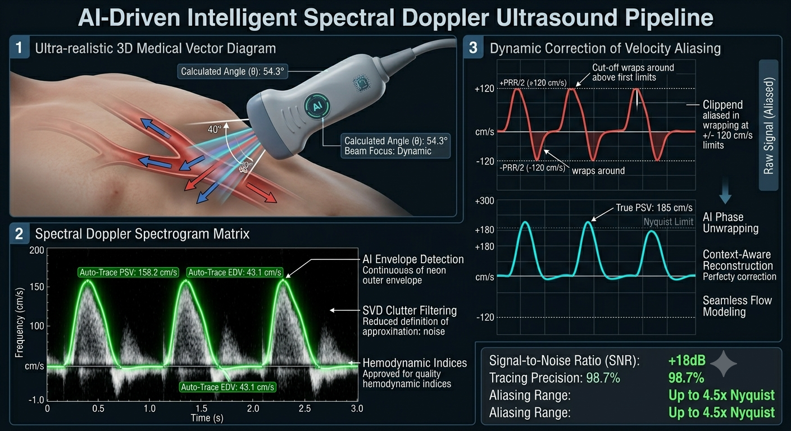

# AI-Driven-Intelligent-Spectral-Doppler-Pipeline
Educational &amp; Training Platform
# AI-Driven Intelligent Spectral Doppler Pipeline (Phase 1)
### 🎓 An Interactive Physics-Informed Educational & Diagnostic Simulator

---

## 📌 Target Audience & Educational Value
This open-source repository is specifically designed as a **dual-purpose educational and translational framework** bridging clinical acoustic physics with digital signal processing (DSP) and data science. It is tailored for:
* **Biomedical Engineering Students & Professionals:** To visually and auditorily grasp how firmware design, sampling rates, and vector electronics translate physical blood flow into diagnostic data.
* **Clinical Engineers & Ultrasound Technicians:** To investigate hardware limitations, signal artifacts, and the non-linear math behind alignment errors.
* **Cardiologists & Medical Practitioners:** To experience an interactive environment demonstrating how scanning angles and physical limits (like Nyquist) directly skew onscreen clinical waveforms and calculated velocities.

---

## 🔬 Physics-Informed Core Pipeline Architecture

Phase 1 establishes a complete, transparent physics-to-data workflow divided into four computational modules, allowing users to study signal processing before moving into deep learning models:

### Module 1: Hemodynamic Waveform Simulation & Noise Injector
We mathematically synthesize a non-stationary $1\text{D}$ temporal velocity profile mimicking actual pulsatile blood flow through a cardiac cycle (sharp systolic peaks and exponential diastolic decay):

$$\Delta f(t) = f_{\text{base}} + \Delta f_{\text{max}} \cdot \sin^4(\pi \cdot \text{HR} \cdot t)$$

The pipeline adds controlled Gaussian noise to simulate real-world ultrasound acoustic clutter and thermal channel interference, challenging the student to understand noise-filtering constraints.

### Module 2: Time-Frequency Transformation via STFT
To view the signal like a modern ultrasound monitor, we apply the **Short-Time Fourier Transform (STFT)**. This partitions the continuous stream into localized, overlapping window segments ($w$), computing the Fast Fourier Transform ($\text{FFT}$) sequentially to generate a **$2\text{D}$ Spectrogram Matrix**:

$$\text{STFT}\{x(t)\}(\tau, f) = \int_{-\infty}^{\infty} x(t) w(t - \tau) e^{-j 2 \pi f t} dt$$

### Module 3: Quantitative Bio-Feature Extraction (Auto-Trace)
An intensity-based thresholding algorithm automatically traces the upper velocity border ($V_{\text{max}}$ envelope). It bypasses manual user errors and extracts vital clinical metrics:
* **Pourcelot’s Resistive Index (RI):** $RI = \frac{PSV - EDV}{PSV}$
* **Gosling’s Pulsatility Index (PI):** $PI = \frac{PSV - EDV}{\text{Mean Velocity}}$

### Module 4: Interactive Visual & Auditory Angle Simulator
This module demonstrates vector mechanics. By manually adjusting the probe insonation angle ($\theta$), users can see the spectrogram shrink and simultaneously listen to the audio pitch flatten due to the physical cosine drop:

$$\Delta f = \frac{2 f_0 v \cos\theta}{c}$$

---
Interactive Code (Run instantly on Google Colab): [https://lnkd.in/eVRzmMvd]

---

## 💻 Tech Stack & Getting Started
* **Core:** Python 3.x, NumPy (Vectorized signal math), SciPy (Signal processing)
* **Graphics & UI:** Matplotlib (Spectral mapping), Ipywidgets (Real-time controls)

### Setup:
1. Clone the repository.
2. Open `Doppler_Pipeline_Phase1.ipynb` in **Google Colab** or Jupyter Notebooks.
3. Move the interactive slider to instantly experience the visual and auditory shift!

----

## 👨‍💻 Author & Developer
* **Name:** Eng. Mahmoud Ali Souliman  
* **Professional Role:** Machine Learning Engineer & Medical Equipment Maintenance Specialist.  
* **Credentials:** Specialized Diploma in Medical Equipment and Diagnostic Hardware.  
* **Core Expertise:** Physics-Informed Neural Networks, Clinical Digital Signal Processing (DSP), Diagnostic Ultrasound Instrumentation, and Deep Learning for Healthcare.

---
